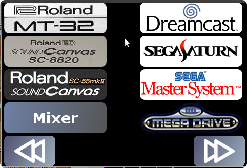
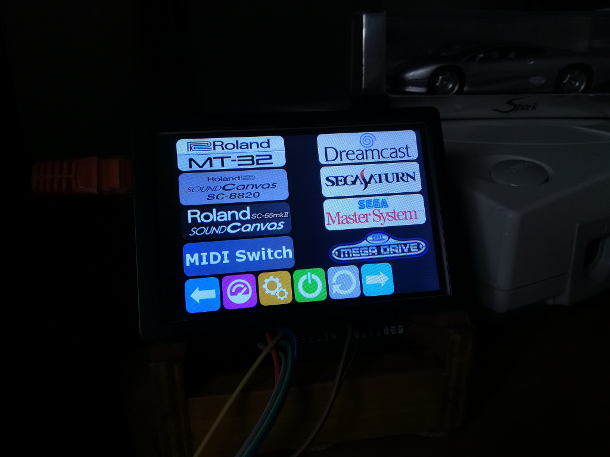
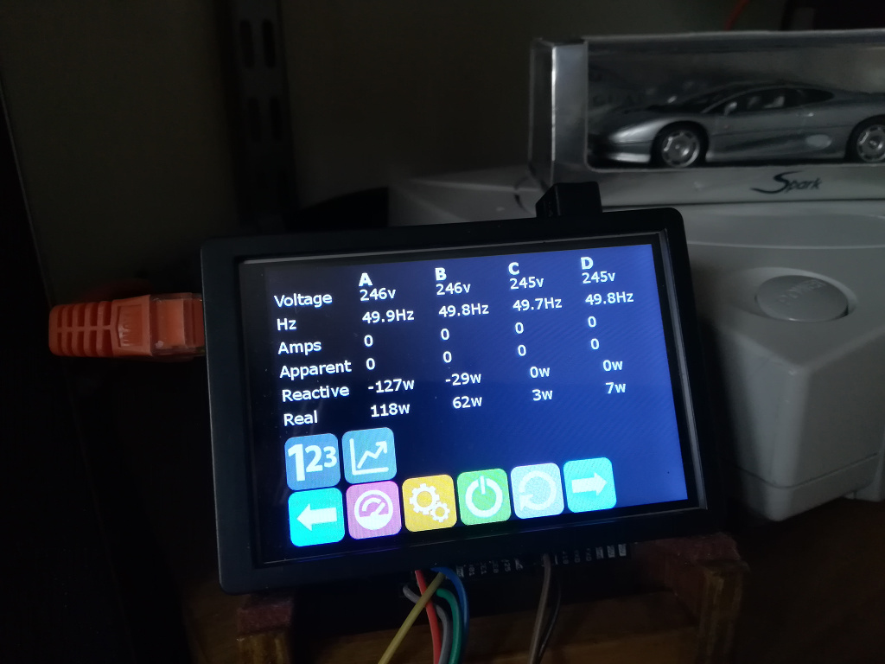
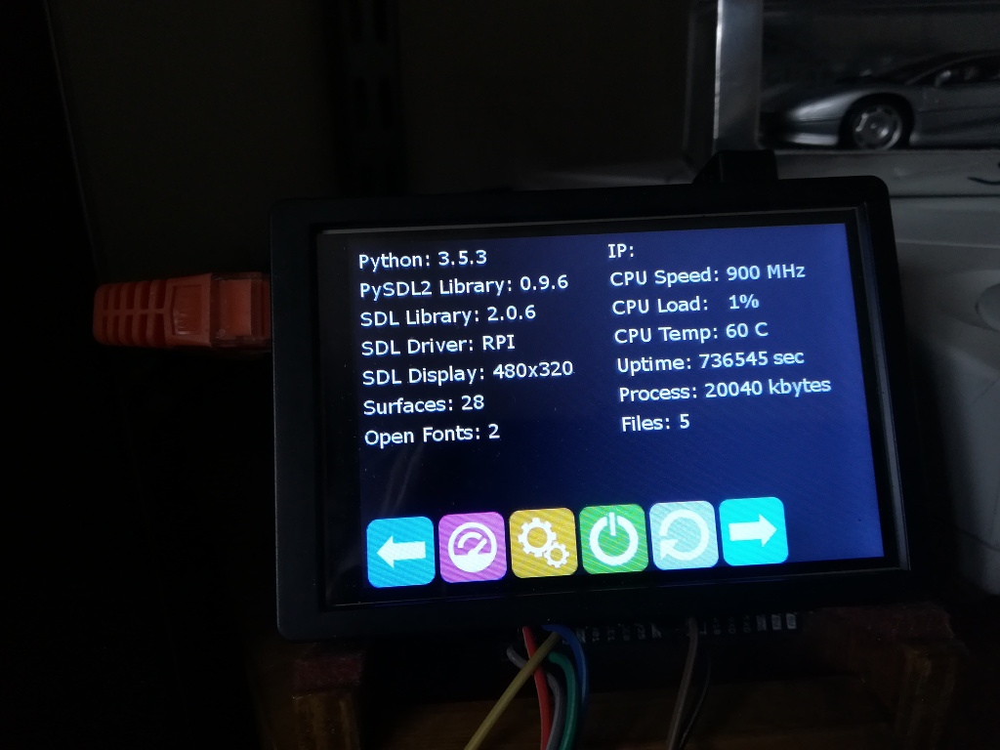
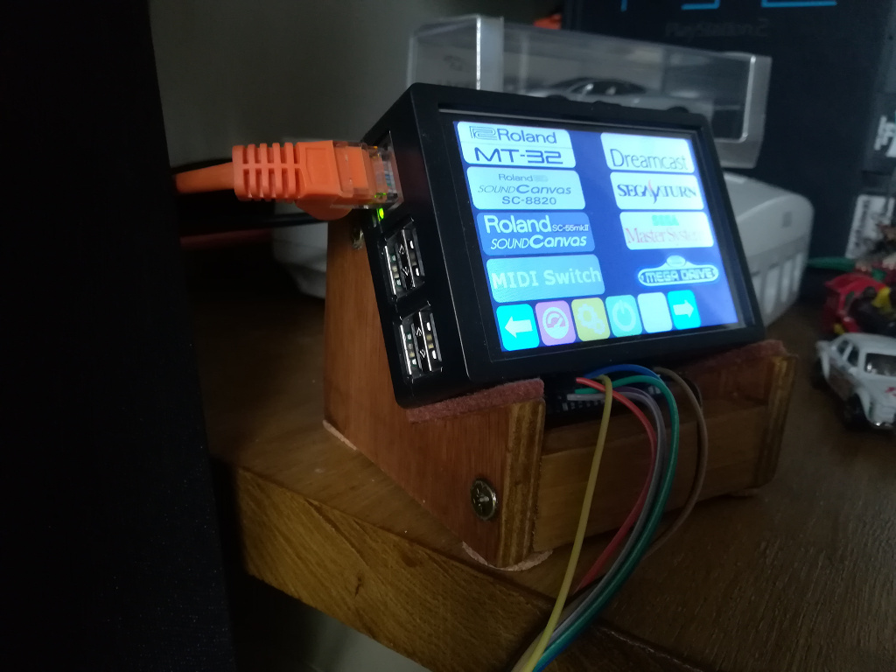
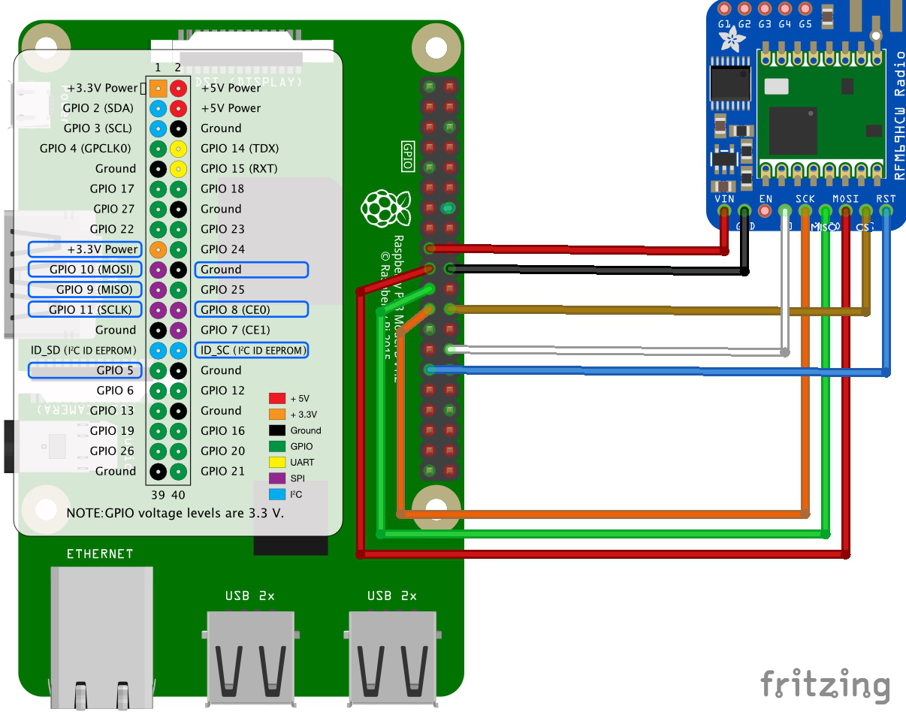
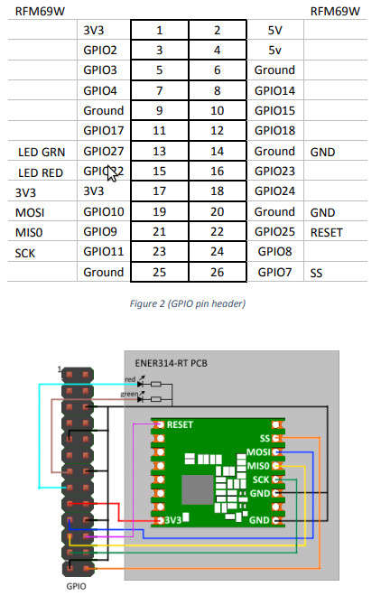

# sdlRFController
SDL touchscreen interface for Raspberry Pi - using RF transmitter to control home power sockets.



It can process sequences of actions to automate turning on or off multiple devices at the same time. For example:

 - First turn on the TV
 - Then turn on the speakers
 - Then turn on your upscaler box
 - Finally turn on the Sega Megadrive

All mapped to a single button on the touchscreen.

## What does it look like?

The main interface:



Power consumption monitor (polling 4 [MiiHome Smart monitor plugs](http://www.energenie.co.uk/catalogue/product/MIHO004))



System status screen:



Homemade cradle to hold the Pi:



---

## Requirements

**Hardware requirements:**

 - Raspberry Pi (tested on 2b and 3b)
 - [Waveshare 3.5" touchscreen](https://www.waveshare.com/3.5inch-rpi-lcd-a.htm) 
 - [RFM69 Radio Module](https://www.google.com/search?q=rfm69+radio&oq=rfm69+radio) or the [Energenie 314-RT](https://energenie4u.co.uk/catalogue/product/ENER314-RT) 
 - One or more [Energenie RF controlled power sockets](https://energenie4u.co.uk/) (tested with ENER02 and ENER010)
 
 **Software requirements**
 
  - Python 3
  - PySDL2 - which requires the following libraries:
    - libSDL2 - *please read the notes below on libSDL2 for Raspbian*
    - libSDL2-TTF - *please read the notes below on libSDL2 for Raspbian*
  
A `requirements.txt` file is provided with which you can automatically install all of the Python packages, simply run:

```
pip install -r requirements.txt
```

### Installing touchscreen

The touchscreen I'm using is a Waveshare/Goodtft 3.5", 480x320 model, interfaced to the Pi via the SPI bus (so not mega fast for high refresh use).

Normally you run through the vendors *install* routine (which ends up being copying the kernel overlay modules to `/boot` and dropping configuration statements in to `/boot/config.txt`). Here's the simplified version:

 - Install waveshare/goodtft driver/config - all you need are the files shown below from your vendors *install*. Ignore everything else they try to get you to install: 
 
```
$ ls -l /boot/overlays/tft35*
-rwxr-xr-x 1 root root  2616 Apr 13 12:45 tft35a.dtbo
-rwxr-xr-x 1 root root  2616 Apr 13 12:45 tft35a-overlay.dtb
```
 
 - Add rotation options to /boot/config.txt depending on the orientation of your screen. I had to add the following to `/boot/config.txt`:

```
framebuffer_width=480
framebuffer_height=320

hdmi_group=2
hdmi_mode=87
hdmi_cvt=480 320 60 1 0 0 0
hdmi_force_hotplug=1

dtparam=spi=on

dtoverlay=tft35a,speed=24000000,fps=30
display_rotate=2
```

 - Install rpi-fbcp, which copies the output sent to the HDMI port back to the touchscreen framebuffer:
 
```
git clone https://github.com/tasanakorn/rpi-fbcp
cd rpi-fbcp
mkdir build
cd build && cmake ..
make && cp fbcp /usr/bin/fbcp
```
 
 - Add /usr/bin/fbcp to /etc/rc.local, before the *exit 0* line:
 
```
#!/bin/sh -e
#
# rc.local
#

/usr/bin/fbcp &

exit 0

```
 
 - Add udev rules for touch interface so that it is seen as a proper touchscreen device (optional, some versions of Linux already do this when the driver is loaded), `/etc/udev/rules.d/95-ads7846.rules` should contain:
 
```
 SUBSYSTEM=="input", KERNEL=="event[0-9]*", ATTRS{name}=="ADS7846 Touchscreen", SYMLINK+="input/touchscreen"
```

 - Install libts:
```
apt-get install libts-bin libts-dev libevdev-dev
```

 - Calibrate touchscreen:

```
TSLIB_FBDEVICE=/dev/fb1 TSLIB_TSDEVICE=/dev/input/touchscreen ts_calibrate
```
 
You can now move on to installing libSDL.
 
### libSDL without X11 for Raspbian

Earlier versions of libSDL2 for Raspbian required the installation of the X11 server in order to produce graphics output. Clearly doing that is running extra stuff that we really don't want or need in an embedded device such as the Pi.

From libSDL2 v2.0.5 output using OpenGL ES *without* X11 running should be supported. However, most vendor-supplied versions of libSDL still only build-in X11 output, as detailed here: https://discourse.libsdl.org/t/problems-using-sdl2-on-raspberry-pi-without-x11-running/22621/3

To be certain you have a version of libSDL that supports OpenGLES output on the Pi *without* X11 you really need to build it from source *and* ensure that you don't have the Raspbian supplied SDL libraries installed.

```
# Remove any vendor installed libsdl2 libraries
apt-get remove libsdl2-dev libsdl2-ttf-dev libsdl2-2.0-0 libsdl2-ttf-2.0-0

# Add input drivers - we'll need these later
apt-get install libts-dev libevdev-dev

# Create temp folder to build sdl2
mkdir /tmp/sdl2
cd /tmp/sdl2

# Download SDL 2.0.10, or a release of 2.0.9 greater than r12671
wget http://www.libsdl.org/tmp/SDL-2.0.zip

unzip SDL-2.0 
cd SDL-2.0.9-12671

./configure --host=arm-raspberry-linux-gnueabihf \
	--disable-video-opengl \
	--disable-video-x11 \
	--disable-pulseaudio \
	--disable-esd \
	--disable-video-mir \
	--disable-video-wayland \
	--enable-video-rpi  \
	--enable-input-tslib
	
# Compile - this takes a while!
make && make install

# Add newly installed lib dirs to library path
echo "/usr/local/lib" > /etc/ld.so.conf.d/local.conf
rm /etc/ld.so.cache
ldconfig
```

Finally, you must also ensure that the Pi is **not** using the accelerated X11 OpenGL kernel module (as it cannot be used at the same time as the full-screen accelerated framebuffer driver), check `/boot/config.txt` to make sure that any reference to `vc4-kms-v3d` is commented out:

```
#dtoverlay=vc4-kms-v3d
```

After that, anything using SDL2 (either directly or via PySDL2) should work normally, outputting full-screen graphics using the hardware OpenGLES2 driver of the Pi and *not* require X11 running.

### Installing energenie library

The Python library to talk to the Energenie RF controlled power sockets is maintained here: https://github.com/whaleygeek/pyenergenie

sdlRFController doesn't need the full package installing, just the C driver and the Energenie device library. You can find them here:

 - [Energenie C device driver](https://github.com/whaleygeek/pyenergenie/tree/master/src/energenie/drv) 
 - [Energenie Python library](https://github.com/whaleygeek/pyenergenie/tree/master/src/energenie) 
 
Presuming you have a directory called *sdlRFController* with my code checked out already, you'll then need to do the following:

```
cd sdlRFController
mkdir tmp
cd tmp
git clone https://github.com/whaleygeek/pyenergenie
cd ..
mv tmp/pyenergenie/energenie .
rm -rf tmp
```

Of course, you are free to place the `pyenergenie` directory anywhere you want and just symlink it in, if you wish.

That will leave you with just the `energenie` sub directory of the pyenergenie project. You then have to compile the C driver:

```
cd energenie/drv
sh build_rpi
```

The resulting binary doesn't need to be installed, the pyenergenie code (and, ultimately sdlRFController) will use it from where you built it.

### Installing Radio module

#### RFM69 module 
 
 see: https://rpi-rfm69.readthedocs.io/en/latest/hookup.html
 
 
 
#### Energenie 314-RT module
 
 See: https://energenie4u.co.uk/res/pdfs/ENER314-RT%20User%20Guide%20V2.pdf



Be aware that if using the Waveshare 3.5" touchscreen that some of the pins needed for the SPI interface of the radio modules are either obscured or in use by the screen. If this is the case you will need to change (at least) the chip-enable (*CE*) pin that the radio module uses; shared used of MISO, MOSI, SCLK, Vin, Gnd *should* all be okay.

---

## Configuring devices

Every device that you want to control must have an entry in the file `libs/config.py`.

The configuration of a device is fairly simple. Each device is represented by a single button on the screen, a button has the following elements defined as a Python dictionary:

| Key | Value |
|------|---------|
| text | Name of the device or activity the power switch refers to |
| image | A bitmap which is shown as the picture for this button *(Note: Image must be no larger than 200x60)*|
| poweron | A series of actions that are taken when pressing this button to turn on the device or activity. |
| poweroff | A series of actions that are taken when pressing this button to turn on the device or activity |
| remote | The home code / remote code / device id that the power strip or switch is keyed to that this device is plugged in to |
| socket | For multi-socket power strips *(ENER010)*, the physical socket that this device is plugged in to |
| tags | metadata which categorises this device. For example: "downstairs lights", "speaker system", "consoles in the boys room", "computer", etc. |

An example button/device for my Roland MT-32 MIDI synthesiser could be:

```
'text'	: "MT-32",
'image'	: "btn_mt32.bmp",
'poweron' : [
		{'remote' : 0xABCD, 'socket' : 1, 'action' : "ON"},	# Turn this remote socket on
],
'poweroff' : [
		{'remote' : 0xABCD, 'socket' : 1, 'action' : "OFF"},	# Turn this remote socket off
],
'remote'	: 0xABCD,
'socket'	: 1,
'tags'	: ["midi"],
```

A little bit of explanation is needed for the above.

 - `btn_mt32.bmp` this image is a 200x60 bitmap stored in the `assets` directory.
 
 - If the *image* field was set to *None*, instead of the bitmap, it would print the *text* field on the button instead - useful when you don't have/need a graphical button, but a simple label will do instead.
 
 - `poweron` - when pressing the on button, we are going to send a single power signal, *"ON"*, using the remote code *0xABCD*, to socket *1*. This corresponds to the single socket we paired the device to. 
    - Syntax 1: `{ 'remote' : REMOTE_ID, 'socket' : SOCKET_NUMBER, 'action' : ["ON"|"OFF"]}`
    
    - Syntax 2: `{ 'tags' : ["tag1", "tag2", "tagN"], 'action' : ["ON"|"OFF"]}`

 - `poweroff` - The same syntax options as `poweron`.

- `tags` - we're tagging this device as *midi*, as we have multiple of these devices that we may want to manage all-together, at some future point.

You should already be able to see that having multiple actions listed for both the `poweron` and `poweroff` variables means that we can automate several series of events. 

### Remote Control Codes

Unfortunately, Energenie remote controls do not have their unique device id / house number / remote id printed on them. The sticker you usually find is either a batch or production code.

When you pair a remote to a power strip/switch, then power switch learns the unique id of the remote you are broadcasting and then only responds to messages broadcast with that id.

Sadly, it's still a bit tricky to work out the device id of a remote. 

For a workaround, see https://github.com/whaleygeek/pyenergenie/issues/81#issuecomment-273619134

Specifically, you need a USB stick supported by RTL-SDR (like a Realtek RTL2832 based DVB), run the RTL-SDR software (https://github.com/merbanan/rtl_433) and monitor the output whilst you pair a Energenie remote control with a power socket. That *should* capture the unique id of your remote control.

You should see output as follows when running `rtl_433 -a`:

```
[00] {25} 8b 4e 87 00 : 10001011 01001110 10000111 0
[01] {25} 8b 4e 87 00 : 10001011 01001110 10000111 0
[02] {25} 8b 4e 87 00 : 10001011 01001110 10000111 0
[03] {25} 8b 4e 87 00 : 10001011 01001110 10000111 0
[04] {25} 8b 4e 87 00 : 10001011 01001110 10000111 0
[05] {25} 8b 4e 87 00 : 10001011 01001110 10000111 0
[06] {25} 8b 4e 87 00 : 10001011 01001110 10000111 0
```

The first 6 hexadecimal characters of the capture output (e.g. 8b 4e 87 in the sample above) should be the id of the remote.

### Macros / Complex Events

Since both the `poweron` and `poweroff` events are list items and can take more than one element, we are free to add multiple actions.

Going back to the example of our Roland MIDI synth, it might make sense when turning on the MIDI module to also turn on the speakers/amplifier and power up the stereo mixer deck. Presuming each of those other devices also have configuration entries (let us say they are represented by another remote id 0xDCBA, using sockets 2 and 3), we could write that `poweron` action as follows:

```
'text'	: "MT-32",
'image'	: "btn_mt32.bmp",
'poweron' : [
		{'remote' : 0xDCBA, 'socket' : 2, 'action' : "ON"},	# Turn on speakers
		{'remote' : 0xDCBA, 'socket' : 3, 'action' : "ON"},	# Turn on stereo mixer
		{'remote' : 0xABCD, 'socket' : 1, 'action' : "ON"},	# Turn the MT-32 MIDI module on
],
'poweroff' : [
		{'remote' : 0xABCD, 'socket' : 1, 'action' : "OFF"},	# Turn this remote socket off
],
'remote'	: 0xABCD,
'socket'	: 1,
'tags'	: ["midi"],
```

Since (in this case) we're dealing with MIDI/music playback, we may also want to turn on a MIDI keyboard or something else as well as speakers, amplifier and mixer. We could continue adding multiple entries in to the `poweron` list, but instead it may be easier to aggregate those items in to a common set of devices. 
For this purpose, we can use the `tags` field.

Presuming our amplifier, mixer deck, speakers and other audio output equipment each has a config entry with the correct remote id and socket, and each of them also has the `tags` entry *"speaker system"* we could instead write:

```
'text'	: "MT-32",
'image'	: "btn_mt32.bmp",
'poweron' : [
		{'tags' : ["speaker system"], 'action' : "ON"},		# Turn on any device with a tag of 'speakers'
		{'remote' : 0xABCD, 'socket' : 1, 'action' : "ON"},	# Turn the MT-32 MIDI module on
],
'poweroff' : [
		{'remote' : 0xABCD, 'socket' : 1, 'action' : "OFF"},	# Turn this remote socket off
],
'remote'	: 0xABCD,
'socket'	: 1,
'tags'	: ["midi"],
```

That would generate a list of individual `poweron` events for any device tagged as *"speaker system", and then finally send a power on signal to the MIDI device.

As the Energenie remote sends discrete *ON* or *OFF* codes, it is safe to send the *ON* code to a device that is already powered on, so we don't need to *(and in fact the system is one-way signalling so we cannot)* check the power status of a device before we send the signal.

## Placing Buttons on Screen

The arrangement of buttons on the screen interface is achieved through *pages*, *columns* and *rows*.

Every *page* on the device (numbered from **1** upwards) is split in to two columns; **left** (referred to as *"L"*) and **right** (referred to as *"R"*).

There are (up to) 4 rows of buttons (each button in a column is numbered from **1** to **4**).

The layout is managed through the `libs/config.py` file, via the variable `SCREENS`.

Here is a sample layout for 1 page, 2 columns (3 buttons on the left, 1 on the right):

```
SCREENS = {
	# First page
	1 : {
		'BUTTON' : { 
			'L' : {
				1 : {
					'text'	: "Monitor",
					'image'	: None,
					'poweron' : [
						{'remote' : 0x0000, 'socket' : 1, 'action' : "ON"},	# Turn this remote socket off
					],
					'poweroff' : [
						{'remote' : 0x0000, 'socket' : 1, 'action' : "OFF"},	# Turn this remote socket off
					],
					'remote'	: 0x0000,
					'socket'	: 1,
					'tags'	: [],
				},
				2 : {
					'text'	: "Amplifier",
					'image'	: None,
					'poweron' : [
						{'remote' : 0x0000, 'socket' : 2, 'action' : "ON"},	# Turn this remote socket off
					],
					'poweroff' : [
						{'remote' : 0x0000, 'socket' : 2, 'action' : "OFF"},	# Turn this remote socket off
					],
					'remote'	: 0x0000,
					'socket'	: 2,
					'tags'	: [],
				},
				3 : {
					'text'	: "Upscaler",
					'image'	: None,
					'poweron' : [
						{'remote' : 0x0000, 'socket' : 3, 'action' : "ON"},	# Turn this remote socket off
					],
					'poweroff' : [
						{'remote' : 0x0000, 'socket' : 3, 'action' : "OFF"},	# Turn this remote socket off
					],
					'remote'	: 0x0000,
					'socket'	: 3,
					'tags'	: [],
				},
			},
			'R' : {
				1 : {
					'text'	: "Sega Megadrive",
					'image'	: None,
					'poweron' : [
						{'remote' : 0x0000, 'socket' : 4, 'action' : "ON"},	# Turn this remote socket off
					],
					'poweroff' : [
						{'remote' : 0x0000, 'socket' : 4, 'action' : "OFF"},	# Turn this remote socket off
					],
					'remote'	: 0x0000,
					'socket'	: 4,
					'tags'	: [],
				},
			},
		},
	},
	# 2: {} # Page 2 doesn't exist in this layout
}
```

You are free to layout buttons on pages as you see fit. In my own use case I'm putting all the video games together on one page, display equipment on another, sound and music on another, etc.

---

## Raspberry Pi Speed/Power Tuning

Some tips to both lower the normal power use of the Pi, as well as speed up boot times:

 - Enable initial turbo to speed up boot
 - Lower minimum clock speed to reduce power while running
 - Use the `ondemand` cpu governor

```
# HDMI & display config
framebuffer_width=480
framebuffer_height=320
hdmi_group=2
hdmi_mode=87
hdmi_cvt=480 320 60 1 0 0 0
hdmi_force_hotplug=1

# CPU / GPU config
initial_turbo=15
arm_freq_min=300
arm_freq=900
core_freq=250
scaling_min_freq=300
scaling_max_freq=900
gpu_mem=128

# I2C/SPI
dtparam=i2c_arm=on
dtparam=spi=on
enable_uart=1
dtparam=audio=on

# TFT module config
dtoverlay=tft35a,speed=24000000,fps=30
display_rotate=2
```

 - Disable power to the USB ports (as long as you don't have a keyboard plugged in!):
 
```
echo 0x0 > /sys/devices/platform/soc/3f980000.usb/buspower
```

 - Disable unecessary system services
 
```
systemctl disable apt-daily.service keyboard-setup.service
systemctl disable hciuart
systemctl mask hciuart
systemctl disable dev-serial1
systemctl disable dev-serial1.device
systemctl stop sys-kernel-debug
systemctl disable sys-kernel-debug.mount
systemctl mask sys-kernel-debug.mount
systemctl disable raspi-config
systemctl mask triggerhappy
systemctl disable wifi-country
systemctl disable alsa-restore
systemctl disable avahi-daemon
systemctl disable triggerhappy
systemctl disable graphical.target
systemctl mask graphical.target
```

That should cut out most services that are not needed for an embedded device. As long as you are either using a relatively standard USB keyboard and HDMI output, or SSH over the wired ethernet connection it should all still work fine.

My setup, with a Pi 2b reports the following boot times:

```
# systemd-analyze 
Startup finished in 2.616s (kernel) + 5.733s (userspace) = 8.350s

# systemd-analyze blame
          2.268s dev-mmcblk0p2.device
           671ms systemd-modules-load.service
           526ms fake-hwclock.service
           515ms networking.service
           455ms loadcpufreq.service
           408ms systemd-fsck@dev-disk-by\x2dpartuuid-80c6bd14\x2d01.service
           404ms systemd-udev-trigger.service
           392ms ssh.service
           347ms systemd-udevd.service
           331ms systemd-timesyncd.service
           302ms run-rpc_pipefs.mount
           257ms systemd-journald.service
           238ms kmod-static-nodes.service
           210ms systemd-random-seed.service
           188ms systemd-fsck-root.service
           185ms dhcpcd.service
           184ms systemd-logind.service
           181ms rsyslog.service
           165ms systemd-tmpfiles-setup-dev.service
           161ms user@1000.service
           147ms cpufrequtils.service
           134ms dev-mqueue.mount
           127ms systemd-sysctl.service
           125ms systemd-remount-fs.service
           119ms systemd-tmpfiles-setup.service
           108ms nfs-config.service
           101ms console-setup.service
            78ms systemd-update-utmp.service
            61ms systemd-journal-flush.service
            60ms var-tmp.mount
            54ms var-log.mount
            52ms systemd-update-utmp-runlevel.service
            43ms rc-local.service
            34ms sys-kernel-config.mount
            31ms boot.mount
            29ms systemd-user-sessions.service
```

From power on to ssh login in 8 seconds really isn't bad at all for a low powered device like the Pi.
